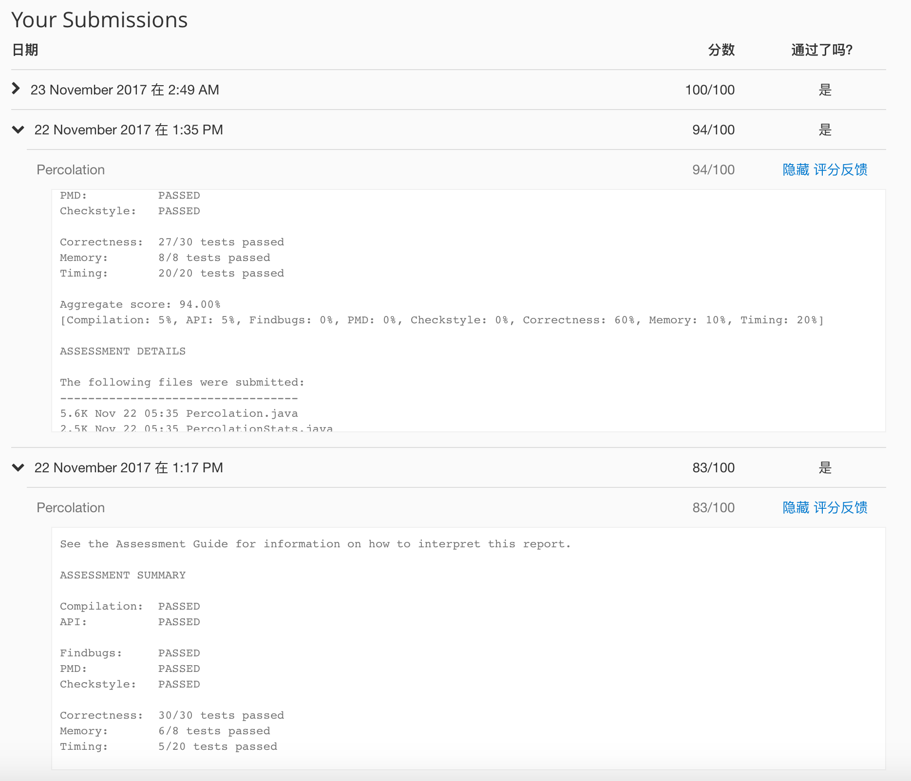

# Percolates解析～

之前测试的时候，要么是

```
Compilation:  PASSED
API:          PASSED

Findbugs:     PASSED
PMD:          PASSED
Checkstyle:   PASSED

Correctness:  27/30 tests passed
Memory:       8/8 tests passed
Timing:       20/20 tests passed
```

要么就是

```
Compilation:  PASSED
API:          PASSED

Findbugs:     PASSED
PMD:          PASSED
Checkstyle:   PASSED

Correctness:  30/30 tests passed
Memory:       6/8 tests passed
Timing:       5/20 tests passed
```

 这样的吧～其实这两个解法恰好是要么只用了 `firstUnionFind` ，对应于第1种情况，判断速度超快，但在有倒灌的时候，`isFull()`会炸；要么就是对应于只用了 `secondUnionFind`，`isFull()`没问题了，但是在判断`percolates()`的时候，需要遍历最后一行的 `n` 个site，判断它们是否与窝们所定义的`VIRTUAL_TOP_SITE`相连通，这会是一个 `O(n)` 次的调用，并且在测试中，这个`percolates()`也随时都会被调用，所以 `Timing`和`Memory（限制窝们调用WeightedQuickUnionUF的次数）`会炸。


### 分析

#### 只使用 firstUnionFind

先来看第一种方法，只用`firstUnionFind`的话，窝们的模型如下


在这种模型之下，窝们在每次 open(row, col) 的时候，只需要一股脑的把上下左右、顶部、底部都考虑清楚就好～

窝们也规定 `row * row`（也就是正好所有小方格编完号之后的下一个位置）就是窝们的 VIRTUAL_TOP_SITE～

那么 VIRTUAL_BOTTOM_SITE 的话，就顺势再多往后 1 个，也就是 `row * row + 1` 的位置w

```java
private static final int VIRTUAL_TOP_SITE = row * row;
private static final int VIRTUAL_BOTTOM_SITE = row * row + 1;

public void open(int i, int j) {
    if ((i < 1) || (i > row) || (j < 1) || (j > row)){
        // Coordinat exception respond set.
        throw new IndexOutOfBoundsException();
	}

    // if this site is already open
	// then we just return
	if (isOpen(i, j)) return;

    // Regulating the evaluation start point in (0,0).
    site[i - 1][j - 1] = true;
  
    // increase open site counter
    numberOfOpenSites += 1;
  
    // Build the iterable position to see through the grid.
    int self = (i - 1) * row + j - 1;
    int up = self - row;
    int down = self + row;
	int left = self - 1;
	int right = self + 1;
  
    // self at first row, top row
    if (i == 1) {
        firstUnionFind.union(VIRTUAL_TOP_SITE, self);
    }
   
    // self at the last row, bottom row
    if (i == row){
		firstUnionFind.union(VIRTUAL_BOTTOM_SITE, self);
	}
  
    // up
    if ((i != 1) && isOpen(i - 1, j)) {
		firstUnionFind.union(up, self);
	}
    // down
	if ((i != row) && isOpen(i + 1, j)){
		firstUnionFind.union(down, self);
	}
    // left
	if ((j != 1) && isOpen(i, j - 1)){
		firstUnionFind.union(left, self);
	}
    // right
	if ((j != row) && isOpen(i, j + 1)){
		firstUnionFind.union(right, self);
	}
}
```

在只使用 `firstUnionFind ` 的情况下，`percolates()`很好写～只需要判断窝们自己假想的TOP和BOTTOM是否在同一个连通分量里就好～

```java
// does the system percolate?
public boolean percolates() {
    return firstUnionFind.connected(VIRTUAL_TOP_SITE, VIRTUAL_BOTTOM_SITE);
}
```

但是～请注意哟～在窝们 `open(row, col)` 里，处理`i == row`，也就是 `self` 在最后一行的情况时，窝们都直接把它和窝们假想的 BOTTOM 连在一起了～

可是题目有说明不能从 BOTTOM 往上倒灌～那么这样子的话，窝们的 `isFull(row, col)` 是肯定会出错的><

最简单的情况是这个，当 n = 3 的时候，

```
+------+-------+------+
|  OP  |       |      |
|  EN  |       |      |
+------+-------+------+
|  OP  |       |      |
|  EN  |       |      |
+------+-------+------+
|  OP  |       |  OP  |
|  EN  |       |  EN  |
+------+-------+------+
```

窝们打开了`(1,1)`,`(2,1)`,`(3,1)`和`(3,3)`，但是真正能注满水的只有`(1,1)`,`(2,1)`,`(3,1)`，如果窝们的算法说`(3,3)`也是满的话，那么就出现了倒灌w

在只用 `firstUnionFind`的情况下，这是无法避免的，因为窝们在开`(3,1)` 的时候，把它和 BOTTOM 连在一起了，在开 `(3,3)` 的时候，也把它和 BOTTOM 连在一起了～于是乎，因为`(3,1)` 又和 TOP 在一起，根据传递性， `(3,3)` 也跟 TOP 在一起了，所以在判断 `isFull(row, col)`会出错／


#### 只使用 secondUnionFind

只用`secondUnionFind`的话，窝们的模型是这样子的～


对于这个模型，窝们的思考方式也很简单，刚才不是说窝们在处理最后一行的时候会因为传递性，出现不可避免的错误嘛～那么这次窝们就不把假想的 BOTTOM 拿进来，窝们只用假想的 TOP，蓝后在最后判断这个系统是否连通的时候，窝们遍历一次最后一行的格子，看看有米有哪一个和 TOP 相连不就好了嘛www

```java
// does the system percolate?
public boolean percolates() {
    // 找到最后一行第一个格子的下标
    int bottomRowStartingIndex = (row - 1) * row;
    // 遍历那一行的 row 个格子～
    for (int i = 0; i < row; i++) {
        // 如果有一个和 TOP 连通
        if (secondUnionFind.connected(VIRTUAL_TOP_SITE, bottomRowStartingIndex + i)) {
            // 那么系统就是连通的
            return true;
        }
    }
    // 否则就是不连通的w
    return false;
}
```

在 `open(row, col)` 部分的话，也就直接不要那个处理最后一行的就可以了w

```java
private static final int VIRTUAL_TOP_SITE = row * row;
// private static final int VIRTUAL_BOTTOM_SITE = row * row + 1;

public void open(int i, int j) {
    if ((i < 1) || (i > row) || (j < 1) || (j > row)){
        // Coordinat exception respond set.
        throw new IndexOutOfBoundsException();
	}

    // if this site is already open
	// then we just return
	if (isOpen(i, j)) return;

    // Regulating the evaluation start point in (0,0).
    site[i - 1][j - 1] = true;
  
    // increase open site counter
    numberOfOpenSites += 1;
  
    // Build the iterable position to see through the grid.
    int self = (i - 1) * row + j - 1;
    int up = self - row;
    int down = self + row;
	int left = self - 1;
	int right = self + 1;
  
    // self at first row, top row
    if (i == 1) {
        secondUnionFind.union(VIRTUAL_TOP_SITE, self);
    }

//    不处理最后一行不就好了么www
//    // self at the last row, bottom row
//    if (i == row){
//		secondUnionFind.union(VIRTUAL_BOTTOM_SITE, self);
//	}
  
    // up
    if ((i != 1) && isOpen(i - 1, j)) {
		secondUnionFind.union(up, self);
	}
    // down
	if ((i != row) && isOpen(i + 1, j)){
		secondUnionFind.union(down, self);
	}
    // left
	if ((j != 1) && isOpen(i, j - 1)){
		secondUnionFind.union(left, self);
	}
    // right
	if ((j != row) && isOpen(i, j + 1)){
		secondUnionFind.union(right, self);
	}
}
```

蓝后愉快的测试了一下刚才 n = 3 的情况，发现米有问题～交到 Coursera 上等着满分的时候，booooom～～～

Timing 和 Memory 炸了， 在 Memory 部分找了出错的原因

```
Test 1a-1e: Creates an n-by-n percolation system; open sites at random until
            the system percolates, interleaving calls to percolates() and open().
            Count calls to connected(), union() and find().

                                       2 * connected()
                 n       union()              + find()        constructor
-----------------------------------------------------------------------------------
=> FAILED       16          209                  5550   (3.0x)          1         
=> FAILED       32          788                 41664   (5.7x)          1         
=> FAILED       64         2873                315642  (10.7x)          1         
=> FAILED      128        12311               2593158  (22.0x)          1         
=> FAILED      256        48164              20430184  (43.3x)          1         
=> FAILED      512       184365             159516356  (84.5x)          1  
```

窝们可以看到，这里窝们在 n = 512 的情况下，居然调用了 1.5 亿次 `connected()  `和`find()`（`connected()`调用加权计算），哪怕是 n = 16 的情况下，窝们都调用了 5550 次。

于是猜想应该是 Coursera 上的测试程序在每次 `open(row, col)` 之后，都会校验窝们对系统是否连通的计算，而很不幸的是，窝们计算一次 `percolates()`，需要遍历最后一排的 n 个小方格是否和假想的 TOP 相连通，于是。。。


#### 没有什么问题是一个算法解决不了的，如果有，那就放两个

那么怎么办呢？`firstUnionFind` 的思路适合于快速判定系统是否连通，但是会导致倒灌，而 `secondUnionFind` 的想法虽然解决了倒灌，但是在有大量判断系统是否连通的情况下，时间上的开销太大。

那么就让它们做自己擅长的事不就好啦～

窝们两个都使用，`open(row, col)` 时两边都做各自需要的操作，蓝后在判断 `percoloates()` 时，只用 `firstUnionFind`，而判断 `isFull(row, col)` 时，只用 `secondUnionFind` 就可以啦／



于是稍稍改一下窝们的代码～(Percolates.Java)

```java
// Percolation Algorithms analysed by CocoaOikawa
// based on IoriOikawa's work

import edu.princeton.cs.algs4.WeightedQuickUnionUF;

// Import public class for weighted quick union algorithms: 
public class Percolation {
    // Major evaluation process definition.
    private final WeightedQuickUnionUF firstUnionFind;

    // Evade of back-wash, by setting up a new direction of percolation.
    private final WeightedQuickUnionUF secondUnionFind;

    // Formulated variation 'row'.
    private final int row;

    // Boolean status for each element in the grid.
    private boolean[][] site;

    // Calculates the amount of current open sites
    private int numberOfOpenSites = 0;
  
    private final int virtualTopSite;
    private final int virtualBottomSite;
  
    // Draw a square grid mounted by n, with basic regulations:
    public Percolation(int n) 
    {
		if (n <= 0) {
            // Evade exceptions.
			throw new IllegalArgumentException(); 
		}
        // index of virtual top site
        virtualTopSite = n * n;
      
        // index of virtual bottom site
        virtualBottomSite = n * n + 1;
      
        // Set relationship array describing perculate status, with BOTH virtual top site and virtual bottom site.
		firstUnionFind = new WeightedQuickUnionUF((n * n) + 2); 
      
		// Set relationship array for evading backwash status, with only virtual top site.
		secondUnionFind = new WeightedQuickUnionUF((n * n) + 1);
		
        // Definite overthrough direction by row, aria limited by n rows.
		row = n;

        // Set grid aria of evaluation as site.
		this.site = new boolean[n][n];
	}
  
    // Helper method:
    private void coordinateValidator(int i, int j)
    {
        if ((i < 1) || (i > row) || (j < 1) || (j > row)) {
            // Coordinat exception respond set.
            throw new IllegalArgumentException();
        }
    }
    
    // Open the site coordinated as (i,j) if it is not open:
    public void open(int i, int j) {
        coordinateValidator(i, j);

        // if this site is already open
        // then we just return
        if (isOpen(i, j)) return;

        // Regulating the evaluation start point in (0,0).
        site[i - 1][j - 1] = true;

        // increase open site counter
        numberOfOpenSites += 1;

        // Build the iterable position to see through the grid.
        int self = (i - 1) * row + j - 1;
        int up = self - row;
        int down = self + row;
        int left = self - 1;
        int right = self + 1;

        // self at first row, top row
        if (i == 1) {
            firstUnionFind.union(virtualTopSite, self);
            secondUnionFind.union(virtualTopSite, self);
        }

        // self at the last row, bottom row
        if (i == row) {
    		firstUnionFind.union(virtualBottomSite, self);
    	}

        // up
        if ((i != 1) && isOpen(i - 1, j)) {
            firstUnionFind.union(up, self);
            secondUnionFind.union(up, self);
        }
        // down
        if ((i != row) && isOpen(i + 1, j)) {
            firstUnionFind.union(down, self);
            secondUnionFind.union(down, self);
        }
        // left
        if ((j != 1) && isOpen(i, j - 1)) {
            firstUnionFind.union(left, self);
            secondUnionFind.union(left, self);
        }
        // right
        if ((j != row) && isOpen(i, j + 1)) {
            firstUnionFind.union(right, self);
            secondUnionFind.union(right, self);
        }
    }
  
    // Evaluate wether the site(i,j) is open:
    public boolean isOpen(int i, int j)
	{
		coordinateValidator(i, j);
		return this.site[i - 1][j - 1];
	}
  
    // Evaluate wether the site(i,j) is full:
    public boolean isFull(int i, int j)
	{
		coordinateValidator(i, j);
      
		int self = (i - 1) * row + j - 1;
        // 这里就让 secondUnionFind 来做～
		return secondUnionFind.connected(virtualTopSite, self);
	}
  
    // Evaluate wether the grid percolates:
    public boolean percolates()
	{
        // Major percolate process.
        // 而这里让 firstUnionFind 来快速检查～
		return firstUnionFind.connected(virtualTopSite, virtualBottomSite);
	}
  
    // Get the number of open sites:
    public int numberOfOpenSites() 
	{
		return numberOfOpenSites;
	}
  
    // Set excutation point for test client:
	public static void main(String[] args) {
        // empty
	}
}

```

